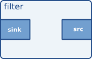

## Gst.Element  
class Gst.Element(**kwargs)

[Gst Element](https://gstreamer.freedesktop.org/documentation/application-development/basics/elements.html?gi-language=c "Gst Element")

- Bases:	Gst.Object
- Abstract:	Yes
- Structure:	Gst.ElementClass

Gst.Element  — это абстрактный базовый класс, необходимый для создания элемента, который можно использовать в конвейере GStreamer.  
#### What are elements?
Для прикладного программиста элементы лучше всего визуализировать в виде черных ящиков. С одной стороны, вы можете что-то вставить, элемент что-то с этим делает, а с другой стороны выходит что-то еще. Например, для элемента декодера вы бы ввели закодированные данные, и элемент выдал бы декодированные данные. В следующей главе (см. разделы и возможности) вы узнаете больше о вводе и выводе данных в элементах, а также о том, как вы можете настроить это в своем приложении.  

Наиболее важным объектом в GStreamer для прикладного программиста является объект GstElement. Элемент - это базовый строительный блок для media-pipline медиа-конвейера. Все различные высокоуровневые компоненты, которые вы будете использовать, являются производными от GstElement. Каждый декодер, кодер, демультиплексор, видео- или аудиовыход на самом деле является элементом GstElement  

Имя Gst.Element можно получить с помощью gst_element_get_name() и установить с помощью gst_element_set_name(). Для скорости можно использовать GST_ELEMENT_NAME() в ядре при использовании соответствующей блокировки. Не используйте это в подключаемых модулях или приложениях, чтобы сохранить совместимость с ABI.

#### Source elements  
Как бы это странно и кринжово не звучало но **src**  - это выход из **Gst.Element** - output 
Источники (**src**) - элементы генерируют данные для использования конвейером, например для чтения с диска или со звуковой карты. Визуализация исходного элемента показывает, как мы будем визуализировать исходный элемент. Мы всегда рисуем исходную панель справа от элемента.  
 
**Исходные элементы не принимают данные, они только генерируют данные.** Вы можете видеть это на рисунке, потому что у него есть только исходная панель (справа). Исходная панель может только генерировать данные.  

#### Filters, convertors, demuxers, muxers and codecs  
Фильтры и фильтроподобные элементы имеют как входные, так и выходные площадки. Они работают с данными, которые они получают на своих входных (приемных) площадках, и будут предоставлять данные на своих выходных (исходных) площадках. Примерами таких элементов являются элемент громкости (фильтр), видеоскейлер (конвертер), демультиплексор Ogg или декодер Vorbis.  
 
Фильтроподобные элементы могут иметь любое количество source or sink pads.  Video demuxer, например, будет иметь одну  one sink pad and several (1-N) source pads, по одной для каждого элементарного потока, содержащегося в формате контейнера. Декодеры, с другой стороны, будут иметь только один источник и приемные площадки.  
   
   
  
 
Этот конкретный элемент имеет одну  one source pad and one sink pad. Приемные площадки, принимающие входные данные, изображены слева от элемента; исходные площадки по-прежнему находятся справа.  
Sink pads, receiving input data, принимающие входные данные, изображены слева от элемента; исходные площадки по-прежнему находятся справа.
   
   

  
Визуализация filter element с более чем output pad показывает другой фильтроподобный элемент, имеющий более одной выходной (source) pad. Примером одного такого элемента может быть, например, демультиплексор Ogg для потока Ogg, содержащего как аудио, так и видео. Одна панель источника будет содержать элементарный видеопоток, другая будет содержать элементарный аудиопоток. Демультиплексоры обычно подают сигналы при создании новой панели. Затем прикладной программист может обработать новый элементарный поток в обработчике сигналов.  

#### Sink elements

Sink elements - это конечные точки в media pipeline. Они принимают данные, но ничего не производят. Запись на диск, воспроизведение звуковой карты и вывод видео - все это будет реализовано  sink elements. Визуализация sink element показывает  sink element.

## gst-inspect-1.0  
**gst-inspect-1.0** Терминальная команда - инструмент имеет три режима работы:

- Без аргументов он перечисляет все доступные типы элементов, то есть типы, которые вы можете использовать для создания экземпляров новых элементов.
- С именем файла в качестве аргумента он обрабатывает файл как подключаемый модуль GStreamer, пытается открыть его и перечисляет все элементы, описанные внутри.
- С именем элемента GStreamer в качестве аргумента он выводит всю информацию об этом элементе.