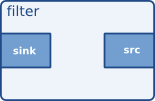

## Tutorial readme

GStreamer — кроссплатформенная конвейерная (pipline) среда с открытым исходным кодом для мультимедиа.  

Базовая структура GStreamer является сердцем дизайна. Он обеспечивает передачу данных, примитивы для согласования типов данных, каналы связи для обмена данными между приложениями и синхронизацию мультимедиа.  

## 1. Basic Terms  

Объект GstElement является основным строительным блоком для медиаконвейера. Все элементы, такие как декодер, кодер, демультиплексор, которые мы видим как черный ящик, были получены из GstElement.  
  
Элементы (такие как such as sink, source or filter) имеют свойства, которые используются для изменения их поведения. У них также есть сигналы, которые помогают им выполнить вызов функции для элемента.

## 2. What is a pipeline in GStreamer?  
Проще говоря, мы берем несколько компонентов GStreamer, таких как video source, video decoder and output source, и соединяем их вместе один за другим! Вот и все!  

From docs —  Отображение только видеочасти видеофайла MPEG-1 с выводом в окно X-дисплея:
```
gst-launch-1.0 filesrc location=/home/msi/Документы/project/angel_pipline/need_dirs/data_in_for_test/episode_114_2_2106/2_inside_cam.mp4 ! decodebin ! queue ! videoconvert ! videobox border-alpha=0 right=-100 ! videomixer name=mix ! videoconvert ! autovideosink 
```

## 3. What is source and sink?

**Source** — исходные источники элементы — это те, которые могут только генерировать данные. Например, видеофайл или IP-камера.

**Sink** - Элементы приемника являются конечными точками конвейера. Например, воспроизведение выходного видео, воспроизведение звуковой карты, экран, запись на диск являются элементами приемника.

## 4. Filters
Фильтры и фильтроподобные элементы имеют как вход, так и выход. Они получают данные, а также отправляют данные после некоторой обработки.

## 5. What are source and sink pads?
Рассмотрим фильтр, который изменяет размер видеокадра (resize). Теперь он будет принимать видеокадр в качестве входных данных и выдавать видеокадр с измененным размером в качестве выходных данных. Точка, в которой он принимает входные данные, называется принимающей площадкой, а точка, из которой он отправляет обработанные данные, называется исходной площадкой.  



### Примеры pipelines
```
gst-launch-1.0 videotestsrc ! videoconvert ! autovideosink
```

- gst-launch-1.0 = Build and launch a pipeline

- videotestsource = sample video from GStreamer examples

- videoconver = Converts video frames to multiple formats

- autovideosink = automatically detects an appropriate video sink to use


**basic-tutorial-1.py**  
```
#!/usr/bin/env python3
import sys

import gi

gi.require_version('GLib', '2.0')
gi.require_version('GObject', '2.0')
gi.require_version('Gst', '1.0')

from gi.repository import Gst, GObject, GLib

pipeline = None
bus = None
message = None

# initialize GStreamer
Gst.init(sys.argv[1:])

# build the pipeline
pipeline = Gst.parse_launch(
    "playbin uri=https://www.freedesktop.org/software/gstreamer-sdk/data/media/sintel_trailer-480p.webm"
)

# start playing
pipeline.set_state(Gst.State.PLAYING)

# wait until EOS or error
bus = pipeline.get_bus()
msg = bus.timed_pop_filtered(
    Gst.CLOCK_TIME_NONE,
    Gst.MessageType.ERROR | Gst.MessageType.EOS
)

# free resources
pipeline.set_state(Gst.State.NULL)
```

#### 1. Самый первый элемент иницализация pipline

```
# initialize GStreamer
Gst.init(sys.argv[1:])
```
Это всегда должна быть ваша первая команда GStreamer. Среди прочего, Gst.init():

- Инициализирует все внутренние структуры  
- Проверяет, какие плагины доступны
- Выполняет любую опцию командной строки, предназначенную для GStreamer

#### 2. gst_parse_launch
```
pipeline = Gst.parse_launch(
    "playbin uri=rtsp://192.168.181.7:1235/test1.sdp"
)
```

GStreamer — это фреймворк, предназначенный для обработки мультимедийных потоков. Медиа перемещается от элементов «источника» (производителей - потока "камеры rtsp:// видеофайлы") к элементам «приемника» (потребителям), проходя через ряд промежуточных элементов, выполняющих всевозможные задачи. Совокупность всех взаимосвязанных элементов называется «конвейером».  

В GStreamer вы обычно строите конвейер, вручную собирая отдельные элементы, но, когда конвейер достаточно прост и вам не нужны какие-либо дополнительные функции, вы можете воспользоваться ярлыком: gst_parse_launch().  

Эта функция берет текстовое представление конвейера и превращает его в настоящий конвейер, что очень удобно. На самом деле, эта функция настолько удобна, что существует инструмент, полностью построенный вокруг нее, с которым вы очень хорошо познакомитесь (см. Основное руководство 10: инструменты GStreamer, чтобы узнать о gst-launch-1.0 и синтаксисе gst-launch-1.0).  

Эта **функция берет текстовое представление конвейера и превращает его в настоящий конвейер**, что очень удобно. На самом деле, эта функция настолько удобна, что вокруг нее построен инструмент, с которым вы очень хорошо познакомитесь.


#### 3. playbin  
Итак, какой конвейер мы запрашиваем gst_parse_launch() построить для нас? Здесь начинается второй ключевой момент: **мы строим конвейер, состоящий из одного элемента, называемого playbin.**

playbin — это специальный элемент, который действует как источник и как приемник, и представляет собой целый конвейер. Внутри он создает и соединяет все необходимые элементы для воспроизведения мультимедиа, поэтому вам не нужно об этом беспокоиться.

Он не обеспечивает такой степени детализации управления, как ручной конвейер, но, тем не менее, допускает достаточную настройку, достаточную для широкого круга приложений. В том числе и этот учебник.

В этом примере **мы передаем в playbin только один параметр** — URI медиафайла, который мы хотим воспроизвести. Попробуйте изменить его на что-то другое! Будь то http:// или file:// URI, playbin прозрачно создаст экземпляр соответствующего источника GStreamer!

 


Если вы ошиблись при вводе URI, или файл не существует, или вам не хватает подключаемого модуля, GStreamer предоставляет несколько механизмов уведомления, но единственное, что мы делаем в этом примере, — завершаем работу при ошибке, так что не ждите большого отклика. 

#### 4. /* Start playing */
```
gst_element_set_state (pipeline, GST_STATE_PLAYING);
or
pipeline.set_state(Gst.State.PLAYING)
```

  Эта строка выделяет еще одно интересное понятие: текущее состояние. У каждого элемента GStreamer есть связанное определенное в коде состояние, которое можно более или менее представить как кнопку «Воспроизведение/Пауза» в обычном проигрывателе DVD. На данный момент достаточно сказать, что воспроизведение не начнется, пока вы не установите конвейер в состояние PLAYING.

***Т.е каждому элементу в pipline можно задавать состояние***

#### 5.   /* Wait until error or EOS */
```
  bus = gst_element_get_bus (pipeline);
  msg =
      gst_bus_timed_pop_filtered (bus, GST_CLOCK_TIME_NONE,
      GST_MESSAGE_ERROR | GST_MESSAGE_EOS);
```

Эти строки будут ждать, пока не произойдет ошибка или не будет найден конец потока. gst_element_get_bus() извлекает шину конвейера, а gst_bus_timed_pop_filtered() будет блокироваться до тех пор, пока вы не получите ERROR или EOS (конец потока) через эту шину. Не беспокойтесь об этой строке, шина GStreamer описана в Базовом руководстве 2: Концепции GStreamer.

Вот и все! С этого момента обо всем позаботится GStreamer. Выполнение завершится, когда носитель достигнет своего конца (EOS) или возникнет ошибка (попробуйте закрыть окно видео или отключить сетевой кабель). Приложение всегда можно остановить, нажав Control-C в консоли.


## Заключение
И так заканчивается ваш первый урок с GStreamer. Мы надеемся, что его краткость послужит примером того, насколько мощным является этот фреймворк!  

Давайте немного подытожим. Сегодня мы узнали:  

Как инициализировать GStreamer с помощью Gst.init().  

Как быстро построить конвейер из текстового описания с помощью Gst.parse_launch().  

Как создать конвейер автоматического воспроизведения с помощью playing.  

Как подать сигнал GStreamer о начале воспроизведения с помощью Gst.Element.set_state().  

Как расслабиться и расслабиться, в то время как GStreamer позаботится обо всем, используя Gst.Element.get_bus() и Gst.Bus.timed_pop_filtered().  
