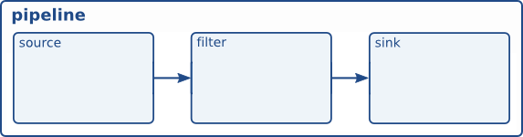
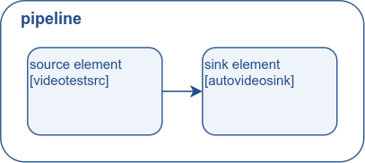
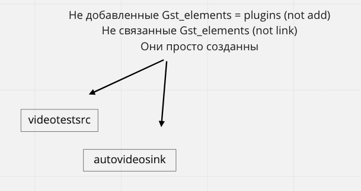
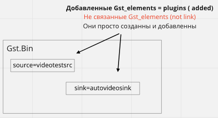
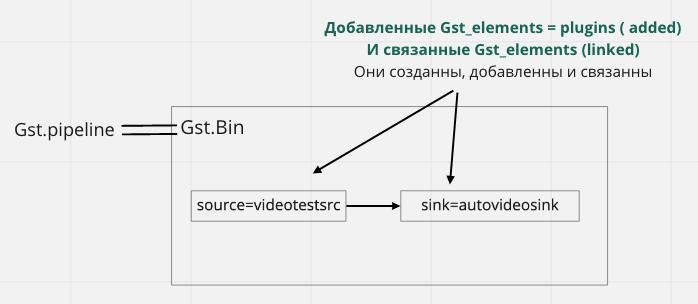
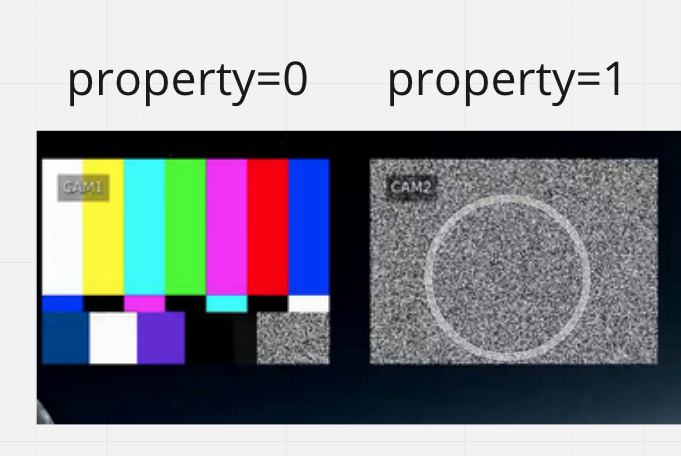

## GStreamer concepts

В предыдущем руководстве было показано, как автоматически создавать конвейер. Теперь мы собираемся создать конвейер вручную, создав экземпляр каждого элемента и связав их все вместе. В процессе мы научимся:  

- Что такое элемент GStreamer и как его создать.  
- Как соединять элементы друг с другом.  
- Как настроить поведение элемента.  
- Как следить за шиной на наличие ошибок и извлекать информацию из сообщений GStreamer.  


**basic-tutorial-2.py**

```
#!/usr/bin/env python3
import sys
import gi
import logging

gi.require_version("GLib", "2.0")
gi.require_version("GObject", "2.0")
gi.require_version("Gst", "1.0")

from gi.repository import Gst, GLib, GObject


logging.basicConfig(level=logging.DEBUG, format="[%(name)s] [%(levelname)8s] - %(message)s")
logger = logging.getLogger(__name__)

# Initialize GStreamer
Gst.init(sys.argv[1:])

# Create the elements
source = Gst.ElementFactory.make("videotestsrc", "source")
sink = Gst.ElementFactory.make("autovideosink", "sink")

# Create the empty pipeline
pipeline = Gst.Pipeline.new("test-pipeline")

if not pipeline or not source or not sink:
    logger.error("Not all elements could be created.")
    sys.exit(1)


# Build the pipeline
pipeline.add(source)
pipeline.add(sink)

# Link elements
if not source.link(sink):
    logger.error("Elements could not be linked.")
    sys.exit(1)

# Modify the source's properties
source.props.pattern = 0
# Can alternatively be done using `source.set_property("pattern",0)`
# or using `Gst.util_set_object_arg(source, "pattern", 0)`

# Start playing
ret = pipeline.set_state(Gst.State.PLAYING)
if ret == Gst.StateChangeReturn.FAILURE:
    logger.error("Unable to set the pipeline to the playing state.")
    sys.exit(1)

# Wait for EOS or error
bus = pipeline.get_bus()
msg = bus.timed_pop_filtered(Gst.CLOCK_TIME_NONE, Gst.MessageType.ERROR | Gst.MessageType.EOS)

# Parse message
if msg:
    if msg.type == Gst.MessageType.ERROR:
        err, debug_info = msg.parse_error()
        logger.error(f"Error received from element {msg.src.get_name()}: {err.message}")
        logger.error(f"Debugging information: {debug_info if debug_info else 'none'}")
    elif msg.type == Gst.MessageType.EOS:
        logger.info("End-Of-Stream reached.")
    else:
        # This should not happen as we only asked for ERRORs and EOS
        logger.error("Unexpected message received.")

pipeline.set_state(Gst.State.NULL)
```  

## Подробнее
Элементы являются основными строительными блоками GStreamer. Они обрабатывают данные по мере их прохождения от элементов-источников (производителей данных) к элементам-приемникам (потребителям данных), проходя через фильтрующие элементы.




### 1. Создание элемента

##### Create the elements (Gst.Element)
https://gstreamer.freedesktop.org/documentation/application-development/basics/elements.html?  
<br/>
https://lazka.github.io/pgi-docs/Gst-1.0/classes/Element.html#Gst.Elementgi-language=python  

Gst.Element — это абстрактный базовый класс, необходимый для создания элемента, который можно использовать в конвейере  
<br/>  
Напомним как выглядит элемент Gst.Element  
<br/>  
**=> sink - это всегда вход**   
  
**src - это всегда выход =>** 
<br/>  
GStreamer.
```
source = Gst.ElementFactory.make("videotestsrc", "source")
sink = Gst.ElementFactory.make("autovideosink", "sink")
```
From doc classmethod of Gst.ElementFactory
```
classmethod make(factoryname, name)  
```

Выходные парааметры в метод:	

- *factoryname (str) – a named factory to instantiate*  
- *name (str or None) – name of new element, or None to automatically create a unique name все имена этогих элементов должны быть разные*  
***factoryname*** - на самом деле это есть плагин который может быть абсолютно любым, например **[avenc_alias_pix,avenc_apng,avdec_dsd_lsbf,videoconvert,videorate,videoscale]**  
<br/>  
***Примеры удобных плагинов:***  
[Handy plugins](https://gstreamer.freedesktop.org/documentation/tutorials/basic/handy-elements.html?gi-language=python)  

<br/> 

Чтоб посмотреть любые (лист-список плагинов) плагины ***factoryname*** можно выбить команду  
```
gst-inspect-1.0
```

Мы увидем большой список плагинов.

Чтоб вывести плагин тестового видео нужно:  
```
gst-inspect-1.0 | grep videotestsrc
```
<br/>
Чтоб вывести информацию о любом плагине нужно:  

```
gst-inspect-1.0  <plugin_name>
```
<br/>  
Список плагинов:  
https://thiblahute.github.io/GStreamer-doc/plugins.html?gi-language=c
<br/>  
<br/>  
yf 
**Returns:**  
*new Gst.Element or None if unable to create element*  
**Return type:**  
*Gst.Element or None*  

Создание нового элемент типа, определенного данной фабрикой элементов. Если name равно None, то элемент получит гарантированно уникальное имя, состоящее из имени фабрики элемента и номера. Если указано имя, ему будет присвоено указанное имя.  

```
# Create the elements
source = Gst.ElementFactory.make("videotestsrc", "source")
sink = Gst.ElementFactory.make("autovideosink", "sink")
```
Как видно из этого кода, новые элементы могут быть созданы с помощью **Gst.ElementFactory.make()**. Первый параметр - это тип создаваемого элемента factoryname= plugin_name который можно получить из gst-inspect-1.0. Второй параметр - это имя, которое мы хотим присвоить этому конкретному экземпляру. Присвоение имен вашим элементам полезно для их последующего извлечения, если вы не сохранили указатель (и для более содержательного вывода отладки). Однако, если вы передадите None для имени, GStreamer предоставит вам уникальное имя.  
<br/>  
Для этого урока мы создаем два элемента: videotestsrc и autovideosink. Здесь нет фильтрующих элементов. Следовательно, конвейер будет выглядеть следующим образом:  
  
Обратите внимание что на картинке изображенно немного некоректно - т.к. элементы еще не соеденны и не добавленны в pipe
<br/>  
**Вот коректный вариант элементы добавляются в области:**



**videotestsrc** - это исходный элемент (он генерирует данные), который создает шаблон тестового видео. Этот элемент полезен для целей отладки (и учебных пособий) и обычно не встречается в реальных приложениях.

**autovideosink** - это элемент приемника (он потребляет данные), который отображает в окне изображения, которые он получает. Существует video sinks, в зависимости от операционной системы, с различным диапазоном возможностей. **autovideosink ,автоматически выбирает и создает лучший экземпляр**, так что вам не нужно беспокоиться о деталях, а ваш код более независим от платформы.  

### 2. Pipeline creation  
```
# Create the empty pipeline
pipeline = Gst.Pipeline.new("test-pipeline")
```
Все **элементы в GStreamer должны содержаться внутри конвейера**, прежде чем их можно будет использовать, потому что он заботится о некоторых функциях синхронизации и обмена сообщениями. Мы создаем конвейер с помощью Gst.Pipeline.new().  


```
# Build the pipeline
pipeline.add(source)
pipeline.add(sink)

# Link elements
if not source.link(sink):
    logger.error("Elements could not be linked.")
    sys.exit(1)
```

Gst.Pipeline - Pipeline (конвейер) - это особый тип Gst.Bin, который является элементом, используемым для хранения других элементов. Поэтому все методы, которые применяются to bins , применимы и к pipelines.  
**Gst.Pipeline <= наследовался от Gst.Bin**

В нашем случае мы вызываем Gst.Bin.add(), чтобы добавить элементы в конвейер. Функция принимает любое количество элементов Gst в качестве своих аргументов. И добавленные элементы помещает в контейнер Gst.Bin==Gst.Pipline
```
pipeline.add(source)
pipeline.add(sink)

```


Однако эти элементы пока не связаны друг с другом. Для этого нам нужно использовать **Gst.Element.link()**. Его первый параметр - это источник, а второй - пункт назначения. **Порядок имеет значение**, поскольку связи должны устанавливаться в соответствии с потоком данных (то есть от исходных элементов к приемным элементам). Имейте в виду, что только элементы, находящиеся в одной ячейке, могут быть связаны друг с другом, поэтому не забудьте добавить их в конвейер, прежде чем пытаться связать их!
<br/>  

**Линковка - связывание моделей =>**  
```
source.link(sink)
```  

Так как к source прикрепляется sink можно рассматривать как append
Условный порядковый номер у элементов:  
source - №1  
sink   - №2  




Все элементы GStreamer представляют собой особый вид GObject.Object, который является объектом, предлагающим объекты свойств.

Большинство элементов GStreamer имеют настраиваемые свойства: именованные атрибуты, которые можно изменять для изменения поведения элемента (свойства, доступные для записи) или запрашивать, чтобы узнать о внутреннем состоянии элемента (свойства, доступные для чтения).

Чтобы понять, как получать и устанавливать свойства, давайте предположим, что у нас есть источник GstElement с шаблоном свойств

#### Получение свойств.
Текущее состояние свойства может быть получено с помощью любого:

Доступ к свойству как к атрибуту атрибута props элемента. Пример Ex: _ = source.props.pattern, чтобы распечатать его на экране
Используя метод get_property элемента. Пример Ex: _ = source.get_property("pattern")

#### Изменение. Cвойства могут быть заданы одним из трех методов:

1. Установка свойства в качестве атрибута атрибута props. Пример: source.props.pattern = 1 или, что эквивалентно, source.props.pattern="снег"
2. Используя метод set_property элемента. Пример: source.set_property("шаблон", 1) или эквивалентно source.set_property("pattern", "snow")
3. Используя метод Gst.util_set_object_arg(). Этот режим также позволяет передавать Gst Caps и другие структуры. Пример: Gst.util_set_object_arg(source, "pattern", "snow") или, что эквивалентно, Gst.util_set_object_arg(source, "pattern", 1)


Изменяя свойства у source.props.pattern по сути это свойствао плагина **videotestsrc** которое мы устанавливали командой   
*source = Gst.ElementFactory.make("videotestsrc", "source")*
```  
# Modify the source's properties
source.props.pattern = 0
# Can alternatively be done using `source.set_property("pattern",0)`
# or using `Gst.util_set_object_arg(source, "pattern", 0)`
```  
Измення свойство мы изменяем тестовый поток либо 
1. **радужный экран** при:  
*source.props.pattern = 0*  
2. *экран шума* при:  
*source.props.pattern = 1*  

Строка кода выше изменяет свойство «шаблон» в videotestsrc, которое управляет типом тестового видео, которое выводит элемент. Попробуйте разные значения!


## Error checking  
На данный момент у нас построен и настроен весь конвейер, а остальная часть руководства очень похожа на предыдущую, но мы собираемся добавить дополнительную проверку ошибок:


Мы вызываем Gst.Element.set_state(), но на этот раз проверяем возвращаемое значение на наличие ошибок.
```
# Start playing
ret = pipeline.set_state(Gst.State.PLAYING)
if ret == Gst.StateChangeReturn.FAILURE:
    logger.error("Unable to set the pipeline to the playing state.")
    sys.exit(1)
```


```
# Wait for EOS or error
bus = pipeline.get_bus()
msg = bus.timed_pop_filtered(Gst.CLOCK_TIME_NONE, Gst.MessageType.ERROR | Gst.MessageType.EOS)

# Parse message
if msg:
    if msg.type == Gst.MessageType.ERROR:
        err, debug_info = msg.parse_error()
        logger.error(f"Error received from element {msg.src.get_name()}: {err.message}")
        logger.error(f"Debugging information: {debug_info if debug_info else 'none'}")
    elif msg.type == Gst.MessageType.EOS:
        logger.info("End-Of-Stream reached.")
    else:
        # This should not happen as we only asked for ERRORs and EOS
        logger.error("Unexpected message received.")
```

## pipeline.get_bus()  bus.timed_pop_filtered(

Gst.Bus.timed_pop_filtered() ожидает завершения выполнения и возвращается с сообщением Gst.Message, которое мы ранее игнорировали. Мы попросили Gst.Bus.timed_pop_filtered() вернуть, когда GStreamer столкнулся либо с состоянием ошибки, либо с Gst.MessageType.EOS, поэтому нам нужно проверить, какое из них произошло, и вывести сообщение на экран (ваше приложение, вероятно, захочет выполнить более сложные действия).  

Gst.Message - это очень универсальная структура, которая может передавать практически любую информацию. К счастью, GStreamer предоставляет ряд функций синтаксического анализа для каждого типа сообщений.  

В этом случае, как только мы узнаем, что сообщение содержит ошибку (с помощью макроса GST_MESSAGE_TYPE (not introspectable)()), мы можем использовать Gst.Message.parse_error(), который возвращает структуру ошибок GLib GLib.Error и строку, полезную для отладки. Изучите код, чтобы увидеть, как они используются и освобождаются после этого.  


## The GStreamer bus
На этом этапе стоит представить шину GStreamer немного более формально. Это объект, ответственный за доставку приложению Gst.Message, генерируемых элементами, по порядку и в поток приложения. Этот последний пункт важен, поскольку фактическая потоковая передача мультимедиа выполняется в другом потоке, а не в приложении.

Сообщения могут извлекаться из шины синхронно с Gst.Bus.timed_pop_filtered() и его аналогами или асинхронно, используя сигналы (показано в следующем руководстве). Ваше приложение должно всегда следить за шиной, чтобы получать уведомления об ошибках и других проблемах, связанных с воспроизведением.  

Gst.Bus - mesage headler from pipe

## Conclusion
Этот урок показал:

Как создавать элементы с помощью Gst.ElementFactory.make()

Как создать пустой конвейер с помощью Gst.Pipeline.new()

Как добавлять элементы в конвейер с помощью gst_bin_add_many (не для самоанализа)()

Как связать элементы друг с другом с помощью Gst.Element.link()

На этом заканчивается первый из двух руководств, посвященных основным понятиям GStreamer. Далее идет второй.

Помните, что прикрепленным к этой странице вы должны найти полный исходный код учебника и любые дополнительные файлы, необходимые для его создания.