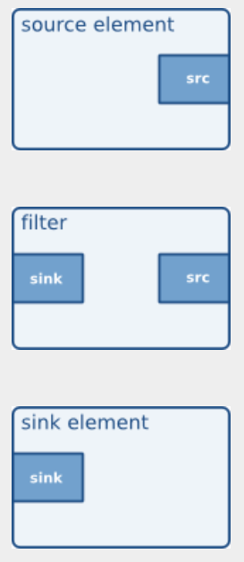
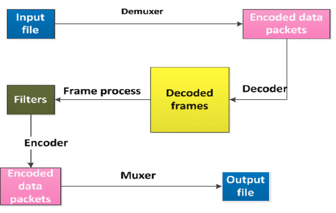
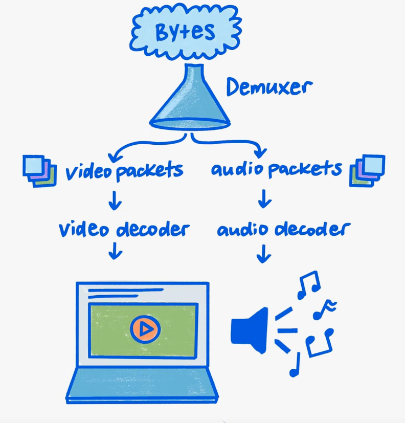

## Dynamic pipelines

В этом руководстве показаны остальные основные понятия, необходимые для использования GStreamer, которые позволяют создавать конвейер «на лету», по мере поступления информации, вместо того, чтобы определять монолитный конвейер в начале вашего приложения.

После этого урока у вас будут необходимые знания для начала обучения по воспроизведению. Здесь будут рассмотрены следующие моменты:

- Как добиться более точного контроля при соединении элементов.

- Как получать уведомления об интересных событиях, чтобы вы могли вовремя реагировать.

- Различные состояния, в которых может находиться элемент.

Вступление

Как вы сейчас увидите, конвейер в этом руководстве не будет полностью построен до того, как он будет переведен в состояние воспроизведения. Это нормально. Если мы не предпримем дальнейших действий, данные достигнут конца конвейера, и конвейер выдаст сообщение об ошибке и остановится. Но мы собираемся предпринять дальнейшие действия...  

В этом примере мы открываем файл, который мультиплексирован (или мультиплексирован), то есть аудио и видео хранятся вместе внутри файла-контейнера. Элементы, ответственные за открытие таких контейнеров, называются демультиплексорами, и некоторыми примерами форматов контейнеров являются Matroska (MKV), Quick Time (QT, MOV), Ogg или формат Advanced Systems (ASF, WMV, WMA).  

Если контейнер встраивает несколько потоков (например, одну видео- и две аудиодорожки), демультиплексор разделит их и предоставит доступ к ним через разные выходные порты. Таким образом, в конвейере могут быть созданы различные ветви, работающие с различными типами данных.  

Порты, через которые элементы GStreamer взаимодействуют друг с другом, называются pads (GstPad). Существуют приемные площадки, через которые данные поступают в элемент, и исходные площадки, через которые данные выходят из элемента. Естественно, из этого следует, что исходные элементы содержат только исходные колодки, элементы приемника содержат только приемные колодки, а фильтрующие элементы содержат и то, и другое.  
  

#### Разберем что такое Muxer/Demuxer

В видеопотоке видеосигнал и аудиосигнал всегда находятся в форматах "контейнеров". Демультиплексоры (Demuxer) извлекают из него потоки и передают их декодерам. А муксеры (Muxer) наоборот кодируют

**Мультиплексирование muxing** (мультиплексирование) - это процесс объединения / смешивания двух вещей в одну. Для фильмов в формате mpeg это означает объединение данных видеопотока и данных аудиопотока.

**Демультиплексирование demuxing** (демультиплексирование) является обратным. Разделение одной вещи на две или более вещей. т.е. восстановление основных видео- и аудиоданных в отдельные файлы.

Original English  
 
Multiplexing (muxing) is the process of joining/intermixing two things into one. For mpeg movies this means joining video stream data and audio stream data.

Demultiplexing (demuxing) is the inverse. Splitting one thing into two or more things. i.e. recovering the basic video and audio data into separate files.
   

## Demuxer

Демультиплексор содержит одну  one **sink pad**, через которую поступают мультиплексированные данные, и несколько исходных площадок, по одной для каждого потока, найденного в контейнере:

  
A demuxer with two source pads.  

Для полноты здесь у вас есть упрощенный конвейер, содержащий демультиплексор и две ветви, одну для аудио и одну для видео. Это НЕ тот пайплайн, который будет построен в этом примере:

Основная сложность при работе с demuxers заключается в том, что они не могут выдать никакой информации, пока не получат некоторые данные и не получат возможность взглянуть на контейнер, чтобы увидеть, что находится внутри. Это означает, что демультиплексоры начинаются без исходных площадок, к которым могут подключаться другие элементы, и, следовательно, конвейер обязательно должен заканчиваться на них.